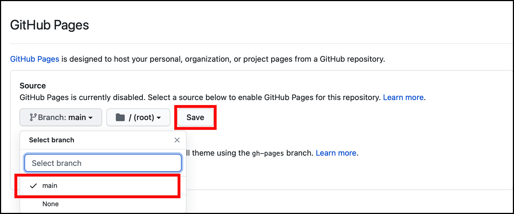

# `gitlinks` - Git Powered Go-Links
<p align = 'center'>
    Hosted "<a href="https://yiou.me/blog/posts/google-go-link">Go-Links</a>" via Git and <a href="https://pages.github.com">GitHub Pages</a>
    <br/>
    <code>pip install gitlinks</code>
    <br/>
    <p align = 'center'>
    
    </p>
</p>

# Quick Overview

`gitlinks` is a command line tool that maps custom shortlinks to URLs via
[Git](https://git-scm.com) and [GitHub Pages](https://pages.github.com) .
The following table shows example mappings for user `lengstrom`'s gitlinks repository
[goto](https://github.com/lengstrom/goto):

| Key           | URL                                 | GitHub Pages Shortlink                    |
| :------------ | :---------------------------------- | :---------------------------------------- |
| `zoom`        | https://mit.zoom.us/j/95091088705   | http://loganengstrom.com/goto/zoom        |
| `classes/NLP` | https://canvas.mit.edu/courses/7503 | http://loganengstrom.com/goto/classes/nlp |

Here, anyone can access the
`zoom` link https://mit.zoom.us/j/95091088705 at http://loganengstrom.com/goto/
(since the GitHub pages site `lengstrom.github.io` maps to `loganengstrom.com`).
We can also organize keys through nesting, such as with `classes/NLP`.

`gitlinks` works by [storing state on GitHub](https://github.com/lengstrom/goto/blob/main/index.csv)
and [rendering structured redirects on GitHub pages](https://github.com/lengstrom/goto). Add, remove, and visualize link mappings through the command line!

```
$ gitlinks set zoom https://mit.zoom.us/j/95091088705
  => Success: Set key "zoom" → "https://mit.zoom.us/j/95091088705".
```
```
$ gitlinks delete zoom
  => Success: Deleted key "zoom".
```
```
$ gitlinks show
=> Checking for changes from remote...
== GitLinks (Remote: git@github.com:lengstrom/goto.git) ==
calendly                 →   https://calendly.com/loganengstrom
classes/18.102           →   http://math.mit.edu/~rbm/18-102-S17/
classes/6.005            →   http://web.mit.edu/6.031/www/fa18/general/
ffcv_slack               →   https://ffcv-workspace.slack.com/join/shared_invite/zt-11olgvyfl-dfFerPxlm6WtmlgdMuw_2A#/shared-invite/email
papers/bugsnotfeatures   →   https://arxiv.org/abs/1905.02175
zombocom                 →   https://www.zombo.com
zoom                     →   https://mit.zoom.us/j/95091088705
```

`gitlinks` also generates an index page: see
http://loganengstrom.com/goto/ as an example. The big caveat of `gitlinks` is that <b>all of your links are public to anyone on the web</b>, so be careful with what you link!

# Setup

Configure `gitlinks` in two steps!

## Set-up GitHub Repository

First, visit https://github.com/new and choose a short, memorable name like
`go` for your gitlinks repository.


Now, check the box "Add a README file" (the repository can't be empty).


Make the repository, then go your repository's GitHub pages settings:
`https://github.com/yourusername/repository_name/settings/pages` and **enable GitHub pages** for the `main` branch:



## Initialize `gitlinks` locally

### pip

Install the `gitlinks` executable via `pip`: `pip install gitlinks`. Then,
initialize `gitlinks` to use your repository: `gitlinks init remote_url`.
Your `remote_url` can be found here:


### manual, with [pipx](https://pypa.github.io/pipx/)

```
git clone https://github.com/Mehvix/golink.git
cd golink
pipx install .
```

---

After this step, you should be able to make go-links to your heart's content.


# todos

- [x] Dark theme (OneDark?)
- [x] Migration CLI function
- [ ] Faster forwarding?
- [ ] Better arg parsing
- [ ] Mobile support

# License
GPL v3